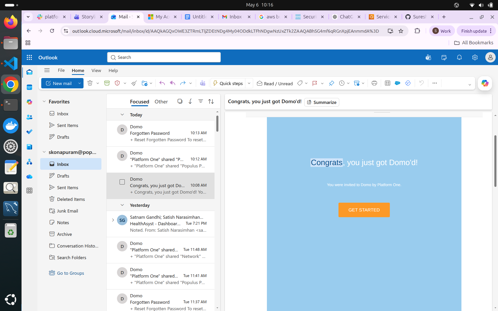
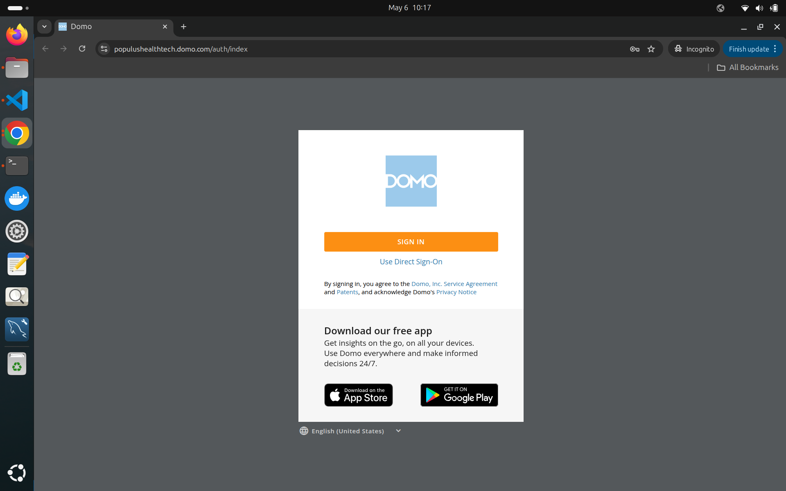
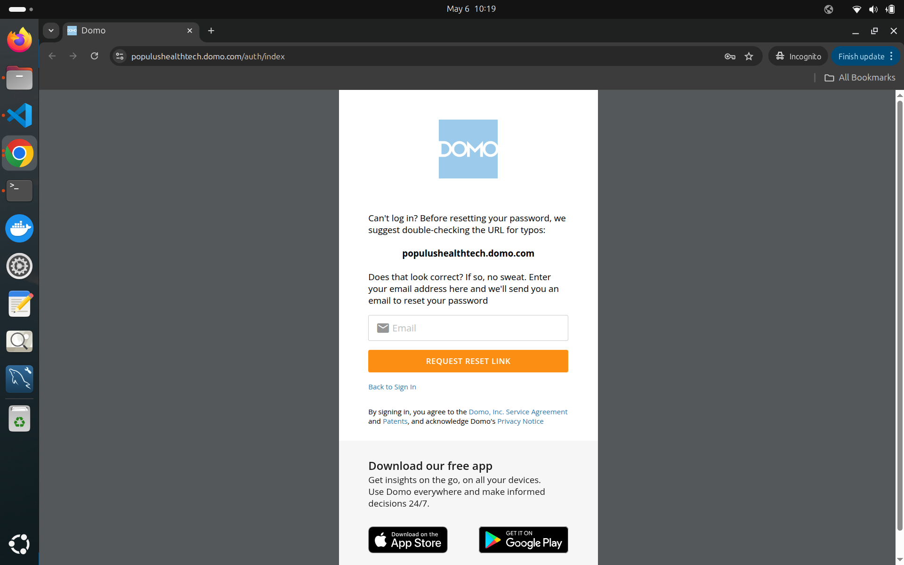
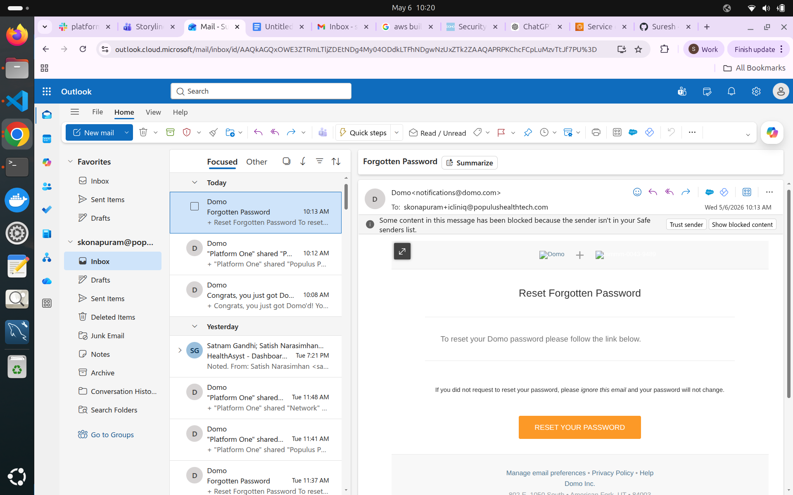

# 📘 Domo Access Setup Guide (Populus Partner App)

## 🔹 Overview
This guide will help you log in to Domo for the first time and access the Populus Partner App dashboards.

---

## 🚀 Step-by-Step Instructions

### Step 1: Accept the Invitation
- Check your email inbox for an invitation from Domo  

- Subject line: **"Congrats, you just got Domo'd!"**  
- Open the email and click on **Get Started**

---

### Step 2: Open Login Page
- After clicking **Get Started**, you will be redirected to the Domo login page  

---

### Step 3: Use Direct Sign-On
- Click on **Direct Sign-On** option  

---

### Step 4: Reset Password (First-Time Users Only)
- Click on **Forgot Password**  

- Enter your registered email address  
- Click on **Request Reset Link**  

---

### Step 5: Set Your Password
- Check your email inbox  

- Open the password reset email  
- Click on the reset link  
- Set your new password and confirm it  

---

### Step 6: Login to Domo
- Go back to the original invitation email  

- Click **Get Started** again  
- Click on **Direct Sign-On**  
- Enter your email and newly created password  

---

### Step 7: Access the Application
- Once logged in:  
  - Navigate to the **Apps** section  
  - Click on **Populus Partner App**  
  - You will now be able to view your dashboards  

---

## ✅ Notes
- Ensure you use the same email ID that received the invitation  
- If you don’t see the reset email, check your **Spam/Junk** folder  
- For any access issues, contact your admin/support team  